# ALAN IDE Phase 3 Implementation Plan

## Overview

This document outlines the detailed implementation strategy for Phase 3 of the ALAN IDE project. Building on the successful development of the ConceptFieldCanvas, EdgeConnection system, and Field Meditation Mode, this plan covers the 9-week development cycle (May 9 - July 10, 2025) to deliver an alpha-quality, developer-facing ALAN IDE.

## System Architecture

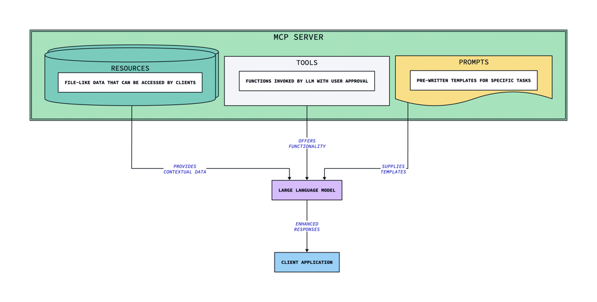

The Phase 3 architecture implements a hybrid integration between your existing visualizations and the new components:

1. **Frontend Layer**
   - React-based UI components with ConceptFieldCanvas as the primary visualization
   - Monaco/CodeMirror-based code editor with bidirectional sync
   - Persona-adaptive UI with the four identified personas

2. **Core Services Layer**
   - Python AST → Concept-Graph importer
   - Editor ↔ Concept-Graph bidirectional sync
   - Execution Field Tracer for runtime visualization
   - Refactorer and Agent Bridge

3. **Backend Infrastructure**
   - Project Vault Service (secure keystore)
   - MCP Client Layer for agent integration
   - Exporter with lineage tracking

## Implementation Timeline

### Sprint 1: Foundation Layer (May 9-22)

#### Parser + Language Adapters

The ConceptFieldCanvas currently uses mock data. This sprint will implement real data ingestion:

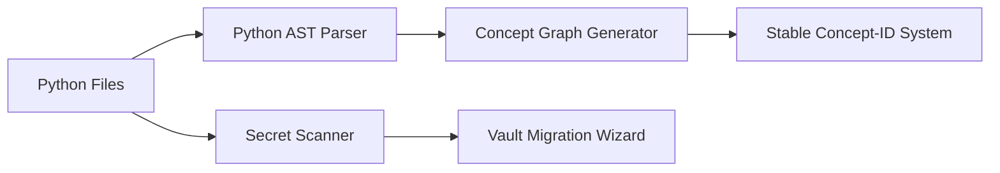

| Component | Implementation Details | Acceptance Criteria |
|-----------|------------------------|---------------------|
| Python AST Parser | - Use Python's `ast` module to parse source files - Create abstract representation of code elements | - Successfully parses Python files - Generates AST representation - Handles syntax errors gracefully |
| Concept Graph Generator | - Transform AST into concept nodes with stable IDs - Generate edges based on import, inheritance, and usage patterns - Maintain phase dynamics mapping | - Creates concept nodes from AST - Establishes appropriate edges - Preserves metadata for visualization |
| Secret Scanner | - Implement TruffleHog rules integration - Scan for API keys, tokens, credentials - Flag potential security issues | - Identifies common secret patterns - Generates security report - Minimal false positives |

#### Project Vault Service

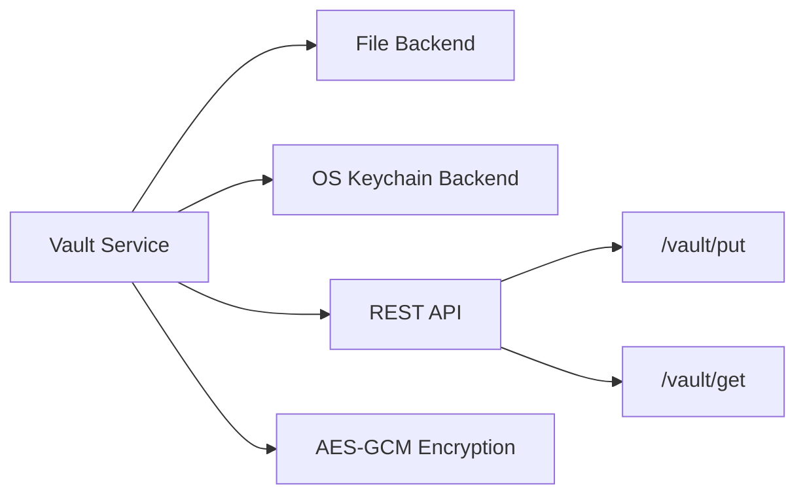

| Component | Implementation Details | Acceptance Criteria |
|-----------|------------------------|---------------------|
| Vault Service Core | - Implement AES-GCM encryption - Create keystore abstraction - Develop key rotation mechanism | - Securely encrypts/decrypts data - Manages keys properly - Passes security audit |
| Storage Backends | - File-based persistent storage - OS keychain integration - In-memory cache for performance | - Successfully stores/retrieves secrets - Falls back gracefully between backends - Maintains consistency |
| REST API | - Implement `/vault/put` endpoint - Implement `/vault/get` endpoint - Add authentication layer | - API correctly stores/retrieves secrets - Securely authenticates requests - Returns appropriate errors |

### Sprint 2: Bidirectional Sync (May 23-June 5)

#### Editor ↔ Concept-Graph Mapping

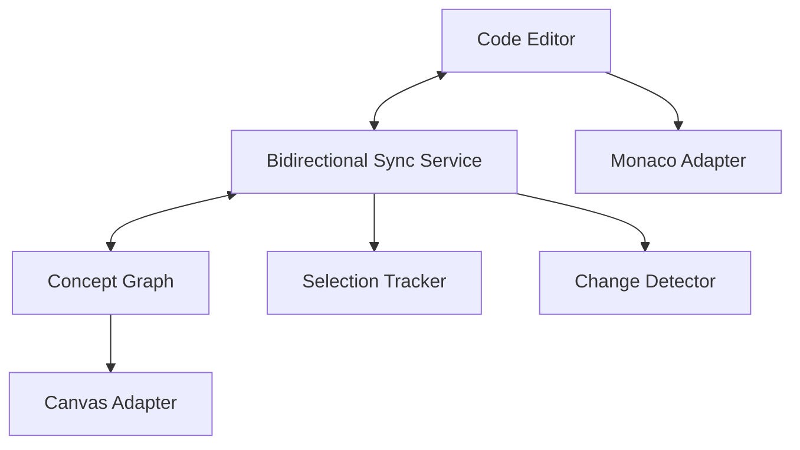

| Component | Implementation Details | Acceptance Criteria |
|-----------|------------------------|---------------------|
| Sync Service | - Implement real-time change detection - Create bidirectional mapping between text positions and concept nodes - Handle concurrent edits | - Changes in editor reflect in graph - Selecting graph nodes highlights code - Maintains consistent state |
| Monaco Adapter | - Integrate with Monaco editor events - Track cursor position and selection - Forward edit operations | - Captures all edit operations - Provides position mapping - Handles complex edits correctly |
| Canvas Adapter | - Update ConceptFieldCanvas to consume real concept data - Implement selection handlers - Add hover information from real code | - Canvas displays accurate representation - Selection in canvas affects editor - Provides relevant hover details |

#### Persona System & Accessibility

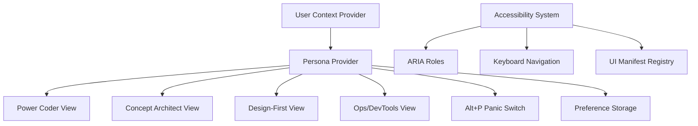

| Component | Implementation Details | Acceptance Criteria |
|-----------|------------------------|---------------------|
| Persona Provider | - Create React context provider for persona state - Implement persona detection heuristics - Develop persona switching UI | - Successfully detects user persona - Switches UI based on persona - Persists preferences |
| Persona Views | - Implement UI layouts for each persona - Create feature flag system for components - Develop hotkey profiles | - Each persona has appropriate view - Views are consistent with requirements - Smooth transitions between personas |
| Accessibility System | - Add ARIA roles to all components - Implement keyboard navigation - Create manifest registry | - Passes axe-core tests - Fully keyboard navigable - Generates complete manifest |

### Sprint 3: Execution & Bridging (June 6-19)

#### Execution Field Tracer

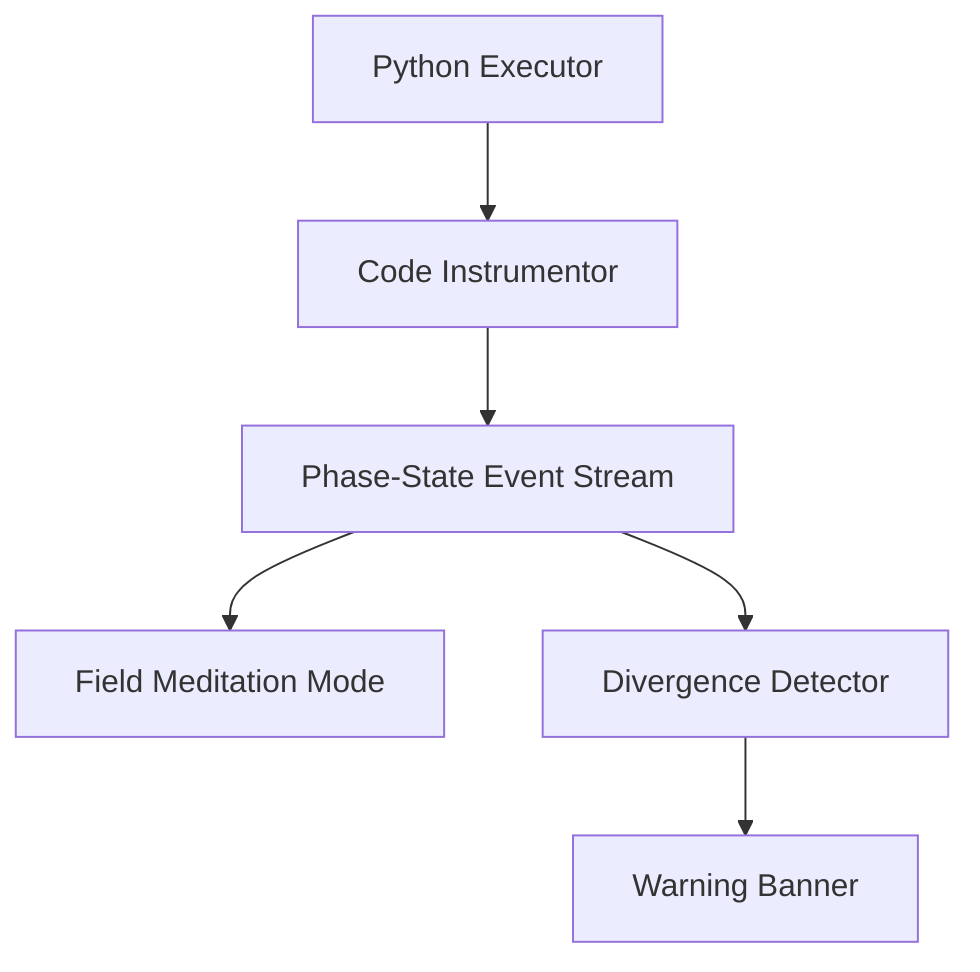

| Component | Implementation Details | Acceptance Criteria |
|-----------|------------------------|---------------------|
| Code Instrumentor | - Develop Python code instrumentation - Track execution flow and state changes - Create phase-state event system | - Successfully instruments code - Captures all execution events - Minimal performance impact |
| Event Stream | - Implement real-time event processing - Create event filtering and aggregation - Develop event visualization mapping | - Processes events in real-time - Correctly categorizes events - Maps events to visual elements |
| Divergence Detector | - Implement pattern detection for anomalies - Create visual warning system - Develop explanation generator | - Accurately detects divergence - Issues clear warnings - Provides useful explanations |

#### Agent Bridge

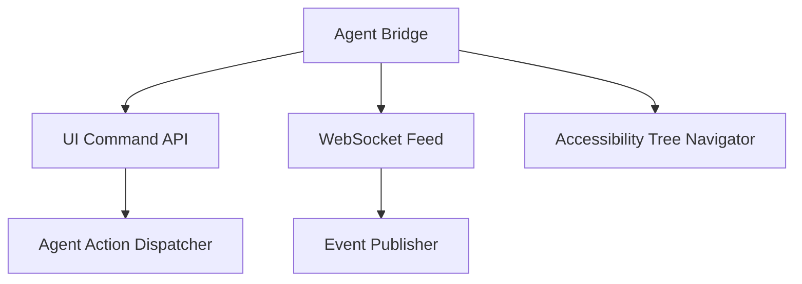

| Component | Implementation Details | Acceptance Criteria |
|-----------|------------------------|---------------------|
| UI Command API | - Implement `/ui/command` endpoint - Create command validation and routing - Develop response handling | - Accepts valid commands - Routes to correct handlers - Returns appropriate responses |
| WebSocket Feed | - Set up WebSocket server - Implement live-region events - Create subscription system | - Establishes stable connections - Publishes relevant events - Manages subscriptions properly |
| Accessibility Tree | - Create accessibility tree navigator - Implement action execution - Develop state query system | - Navigates tree correctly - Executes actions reliably - Queries state accurately |

### Sprint 4: Tools & MCP (June 20-July 3)

#### Refactor Tools

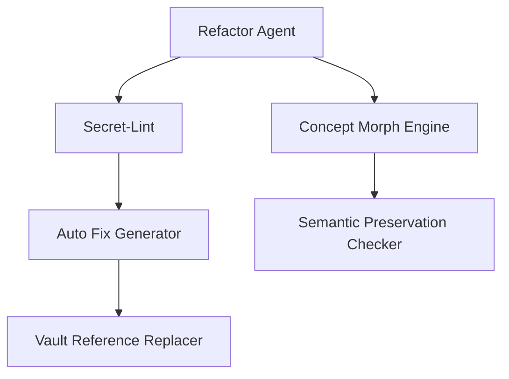

| Component | Implementation Details | Acceptance Criteria |
|-----------|------------------------|---------------------|
| Refactor Agent | - Develop agent-based refactoring system - Implement code transformation rules - Create refactoring preview | - Suggests useful refactorings - Preserves code semantics - Provides clear previews |
| Concept Morph Engine | - Implement graph-based code transformations - Create semantic preservation verification - Develop undo/redo system | - Transforms code correctly - Verifies semantic preservation - Supports undo/redo |
| Secret-Lint | - Implement secret detection in code - Create auto-fix suggestions - Develop vault reference generator | - Finds secrets in code - Suggests appropriate fixes - Generates correct vault refs |

#### MCP Client Layer

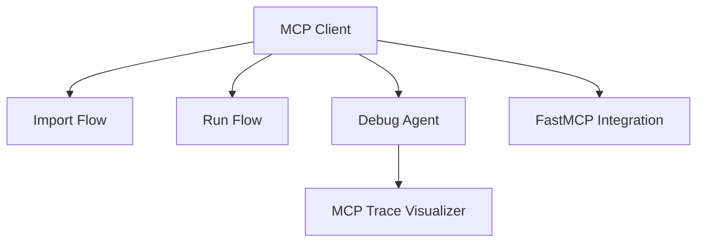

Based on the "Hybrid FastMCP and Lastmile Agent Integration" document:

| Component | Implementation Details | Acceptance Criteria |
|-----------|------------------------|---------------------|
| FastMCP Integration | - Implement FastMCP server - Define IDE tool functions - Create SSE endpoints | - Server starts successfully - Tools execute correctly - Endpoints respond properly |
| Lastmile Agent Integration | - Set up mcp-agent framework - Create agent definitions - Implement LLM interfaces | - Framework initializes properly - Agents execute correctly - LLM interfaces work reliably |
| Debug Agent | - Create MCP trace visualization - Implement trace collection - Develop debugging interface | - Visualizes traces clearly - Collects traces accurately - Provides useful debugging |

### Sprint 5: Exports & Stabilization (July 4-10)

#### Exporter

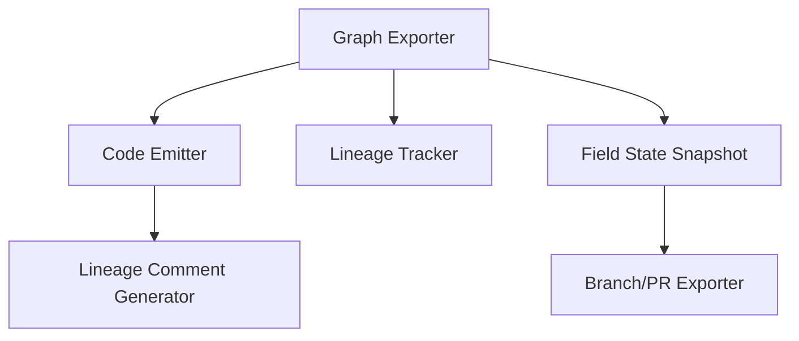

| Component | Implementation Details | Acceptance Criteria |
|-----------|------------------------|---------------------|
| Code Emitter | - Implement Graph→code transformation - Create code formatting system - Develop syntax validation | - Generates valid code - Preserves formatting preferences - Validates syntax properly |
| Lineage Tracker | - Create lineage tracking system - Implement comment generation - Develop metadata preservation | - Tracks concept lineage - Generates informative comments - Preserves all metadata |
| Field Snapshot | - Implement state serialization - Create snapshot comparison - Develop branch/PR integration | - Serializes state correctly - Compares snapshots usefully - Integrates with version control |

#### Alpha Stabilization

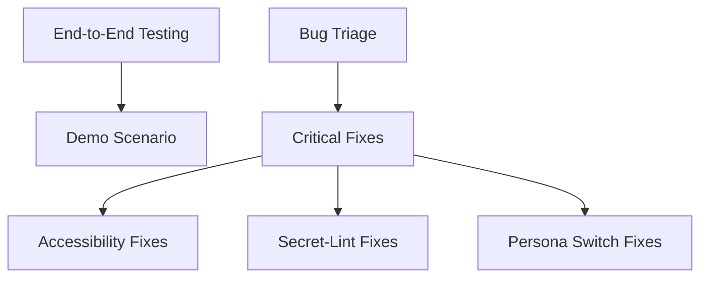

| Component | Implementation Details | Acceptance Criteria |
|-----------|------------------------|---------------------|
| Demo Scenario | - Create end-to-end demo workflow - Develop guided tour - Implement demonstration data | - Workflow executes smoothly - Tour explains features clearly - Demo data showcases capabilities |
| Critical Fixes | - Prioritize and fix accessibility issues - Address secret-lint failures - Resolve persona switching bugs | - Passes accessibility tests - Secret-lint works reliably - Persona switching is stable |
| Final Documentation | - Create user documentation - Develop API documentation - Write developer guides | - Documentation is comprehensive - API docs are accurate - Guides are helpful |

## Implementation Challenges & Strategies

### Challenge 1: ConceptFieldCanvas + Real Code Integration

* *Challenge:** Making the sophisticated ConceptFieldCanvas visualizations work with real imported code.

* *Strategy:**

1. Create an intermediate representation layer that maps between AST structures and concept nodes
2. Implement a staging process where Python code is first parsed to AST, then transformed to concepts
3. Preserve the visual encoding (phase dynamics, edge connections) by mapping code properties to visual properties
4. Add unit tests that verify the visualization integrity after code changes

### Challenge 2: Bidirectional Sync Performance

* *Challenge:** Ensuring responsive performance when syncing between large codebases and concept graphs.

* *Strategy:**

1. Implement incremental updates rather than full refreshes
2. Use efficient change detection algorithms with operation diffing
3. Employ virtualization for rendering large graphs
4. Add background processing for expensive operations
5. Implement caching for frequently accessed elements

### Challenge 3: Execution Tracing Visualization

* *Challenge:** Visualizing execution traces in the Field Meditation Mode without impacting performance.

* *Strategy:**

1. Use lightweight instrumentation that focuses on key events
2. Implement sampling for high-frequency operations
3. Batch event updates to reduce visualization overhead
4. Create adaptive detail levels based on zoom/focus
5. Offload processing to Web Workers where appropriate

### Challenge 4: UI Responsiveness with Complex Visualizations

* *Challenge:** Maintaining responsive UI during complex visualization operations.

* *Strategy:**

1. Implement Web Workers for computational tasks
2. Use virtualization for rendering only visible elements
3. Apply progressive rendering techniques for large graphs
4. Optimize SVG/Canvas operations with proper layering
5. Add loading states and progress indicators for long operations

## Technical Integration Points

### Existing Components Integration

The current implementation provides excellent foundations:

1. **ConceptFieldCanvas:** Already implements node selection, hovering, phase visualization, and geometry modes. Will be extended to:
   - Connect to real data from the Python AST importer
   - Support bidirectional selection with code editor
   - Display real-time execution information

2. **EdgeConnection:** Already implements sophisticated edge rendering with phase alignment and animated flows. Will be enhanced to:
   - Represent real code relationships (imports, inheritance, calls)
   - Update dynamically based on code changes
   - Show runtime relationship information

3. **KoopmanOverlay:** Already implements vector field visualization. Will be extended to:
   - Display real eigenfunction data from code analysis
   - Show execution flow patterns from runtime data
   - Highlight anomalies and divergence in execution

4. **FieldMeditationMode:** Already implements time-based visualization controls. Will be enhanced to:
   - Connect to actual Python execution traces
   - Display real-time execution state
   - Highlight phase transitions in running code

### Vault Service + Python Importer Integration

The Vault Service will integrate with the Python importer through:

1. Pre-import scanning for secrets (using TruffleHog rules)
2. Import wizard with a "Review Secrets → Vault" step
3. Replacement of literal secrets with Vault references
4. Storage of secrets in the encrypted vault

### MCP Integration

Following the "Hybrid FastMCP and Lastmile Agent Integration" document, MCP will be integrated through:

1. A FastMCP server exposing IDE tools
2. Lastmile's agent framework for orchestration
3. SSE transport for real-time updates
4. Tool definitions for core IDE capabilities

## Testing and Validation

### Unit Testing

1. Create unit tests for each new component
2. Implement integration tests for connected components
3. Add performance tests for critical paths
4. Create regression tests for bug fixes

### End-to-End Testing

Implement end-to-end tests for the complete workflow:

1. Importing OSS Python repo
2. Securing secrets → Vault
3. Editing & refactoring via Concept Canvas
4. Running with Execution Graph & agent hints
5. Exporting patched repo

### Quality Gates

Establish quality gates for:

1. WCAG A/AA compliance via axe-core
2. Secret-lint coverage and accuracy
3. Persona switching reliability
4. Performance benchmarks for large codebases

## Conclusion

This implementation plan provides a detailed roadmap for delivering the ALAN IDE Phase 3 within the 9-week timeframe. By building on the existing visualization components and following the hybrid FastMCP integration approach, the team can create a robust, AI-enhanced development environment that brings the innovative concept-field approach to real Python projects.

The implementation prioritizes the key features from the roadmap while addressing the main technical challenges through practical strategies. The result will be an alpha-quality, developer-facing IDE that realizes the vision of code as a dynamical system and sets the foundation for future enhancements.
